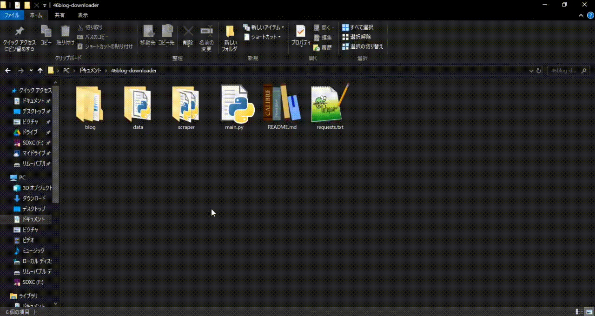
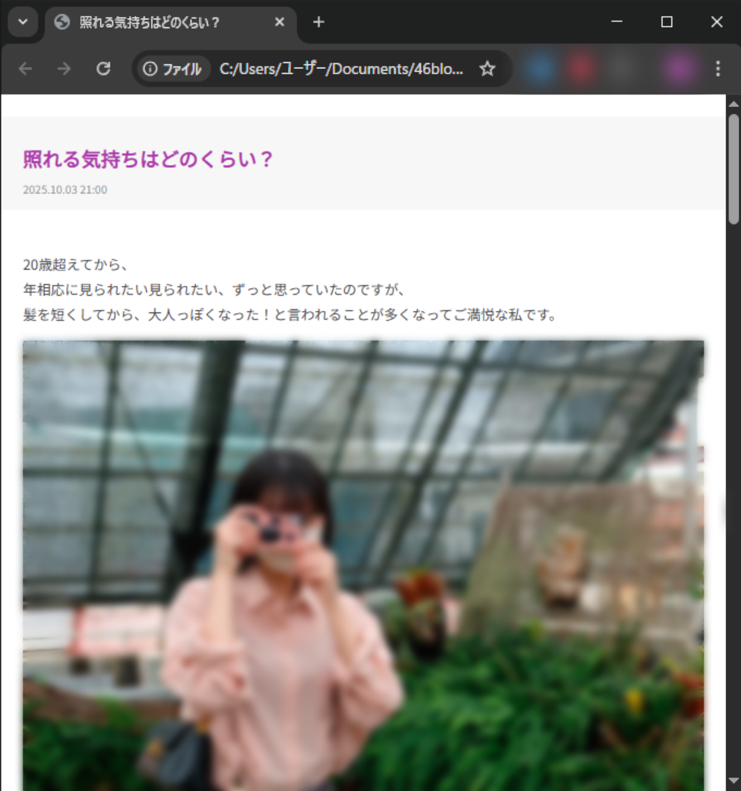
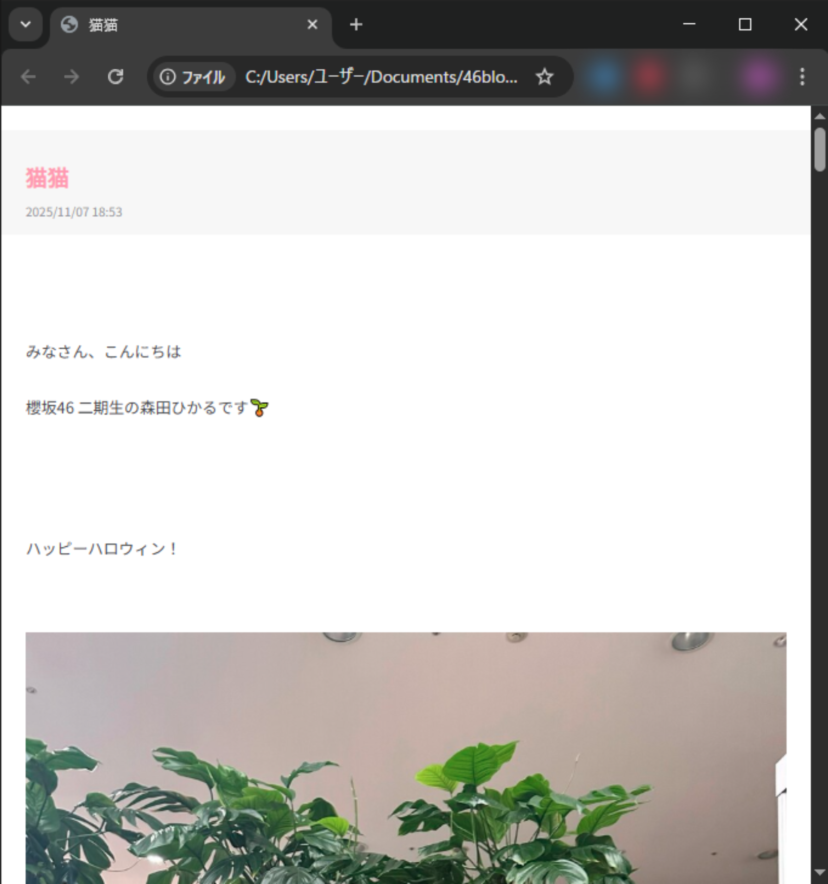

# 坂道ブログスクレイパー◢ ￨⁴⁶

乃木坂46 / 櫻坂46 / 日向坂46 / 欅坂46  
各グループのブログ(公開されているメンバーに限る)を一括保存するCLIツールです

---

## 📑 目次
- [概要](#-概要)
- [環境準備](#-環境準備)
- [使い方](#-使い方)
- [保存フォルダ構造](#-保存フォルダ構造)
- [注意事項](#-注意事項)
- [ライセンス](#-ライセンス)

---

## 📘 概要

- 選択メンバーのブログを全件取得
- 画像をローカルフォルダへダウンロード
- 同時に保存される簡易 HTML でオフライン閲覧が可能  
  （HTML のデザインはシンプルな乃木坂風）

---

## 🔧 環境準備

### 1. とりあえずツール本体をクローン

https://github.com/ra-ly123/46blog-downloader/archive/refs/heads/main.zip  
ここからzipをダウンロードしても使えますが、結局ライブラリインストールに使うのでコマンドで説明します  
とは言ってもPythonとrequests、beautifulsoup4しか使ってないので、この3つが入ってる人はzipをダウンロードして[使い方](#-使い方)に飛んじゃってください  
gitが入ってない場合もzipダウンロードで大丈夫です  

以下を実行

```
git clone https://github.com/ra-ly123/46blog-downloader.git
cd 46blog-downloader
```

---

<details>
<summary>コマンドの実行方法が分からない方へ（Windowsの場合）</summary>


左下の **検索欄** に

```
ターミナル
```

や

```
cmd
```

または

```
PowerShell
```

などを入力すると黒い画面（PowerShell は青）のアプリが出てきます

これらのアプリ(以後CLIと呼称)でコマンドを実行できます(どれでもいいです)

---

検索欄からどうしても出ない場合：

1. エクスプローラーでローカルディスク(C:) を開く  
2. 上のアドレスバー部分（`>PC > ローカルディスク(C:)` のところ）をクリック  
3. `cmd` と入力して Enter

→ で確実に開けます

</details>

---

### 2. Python をインストール(すでにあればスキップ)

Python がまだ入っていない人は便利なのでダウンロードしときましょう：

https://www.python.org/downloads/

➡ インストール時は **「Add Python to PATH」** にチェックを入れてください

そんな項目なかった・忘れたって人は  
お使いの PC の **「環境変数を編集」 → 「Path」** に  
Python 本体のパス（例：`C:\...\Python\Launcher`）を新規追加してください

CLIで以下を実行してバージョンが表示されれば OK：

```
python --version
```

---

### 3. 必要ライブラリをインストール

クローンしたフォルダに移動したCLI(1で開いているもの)で以下を実行

消しちゃったぜって人は`46blog-downloader`のフォルダのアドレスバーに`cmd`と打ってエンターを押すと開けます

```
pip install -r requirements.txt
```

これで準備完了、いつでも使えます

---

## ▶ 使い方

### 1. main.py を実行  
ダブルクリックで OK、ツールのフォルダから`cmd`を開いて以下を実行しても使えるけど当然ダブルクリックの方が楽

```
python main.py
```

---

### 2. グループを選択

```
グループを選択:
1: 乃木坂46
2: 櫻坂46
3: 日向坂46
4: 欅坂46
番号を入力:
```

保存したいメンバーのいるグループの番号を入力しEnter

---

### 3. メンバーを選択

```
メンバーを選択:
1: 愛宕心響
2: 五百城茉央
3: 池田瑛紗
4: 一ノ瀬美空
5: 伊藤理々杏
6: 井上和
7: 岩本蓮加
8: 梅澤美波
9: 遠藤さくら
10: 大越ひなの
・
・
・
番号を入力:
```

ツール作成時にブログが公開されているメンバーの一覧が表示されるので、保存したいメンバーの番号を入力しEnter

最も古いブログまで保存し終えたら停止します

※次回以降同じメンバーを選択した場合、既に保存しているブログはスキップされます

---

## 📂 保存フォルダ構造

保存先は基本的に以下の形式になります：

```
blog/
├── nogizaka/
│   └── 遠藤さくら/
│        ├── YYYY-MM-DD_hh-mm_タイトル/
│        │    ├── YYYY-MM-DD_hh-mm_タイトル.html
│        │    └── image1.jpg
│        │    └── image2.jpg
│        └── ...
```

- **各ブログごとに 1 つのフォルダ**
- **HTML を開けばオフラインでブログの雰囲気を再現できます（雰囲気ね雰囲気）**

<p float="left">
  
  
</p>
グループごとにタイトルの色が変わります

---

ちなみにmain.py の次の行：

```python
save_dir = Path("blog") / group_key / member_name
```

この `"blog"` を好きなフォルダパスに書き換えれば保存先を変えられます(テキストエディタに投げると編集できます)

ただしそのまま書くとエラーになるのでバックスラッシュを二重にするか、スラッシュに置き換えるかしましょう

例 :
```python
save_dir = Path("C:\\Users\\ユーザー\\Downloads\\46") / group_key / member_name
save_dir = Path("C:/Users/ユーザー/Downloads/46") / group_key / member_name
```

---

## ⚠ 注意事項

- 本ツールは **公式サイトのページ構造に依存** しているため、  
  仕様変更により動かなくなる可能性があります。
- 公開されているブログの範囲内で動作します。
- 過度な連続実行は避け、アクセス負荷にご配慮ください。
- **個人利用の範囲** でお使いください。  
  （スクレイピングに関する各サイトの利用規約に従ってください）
- 素人が自分用に作ったツールなので技術的に拙い部分、誤っている部分がある可能性があります。あらかじめご了承ください。
---

## 📄 ライセンス

MIT License


---


